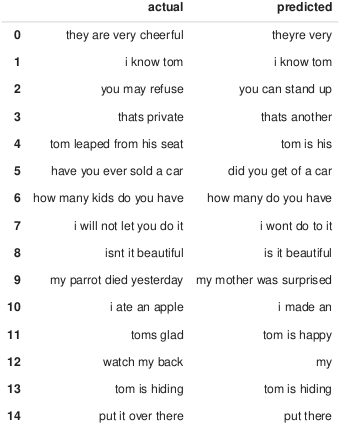
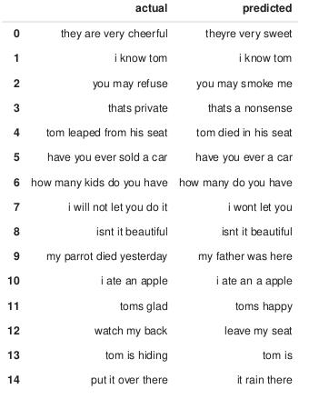
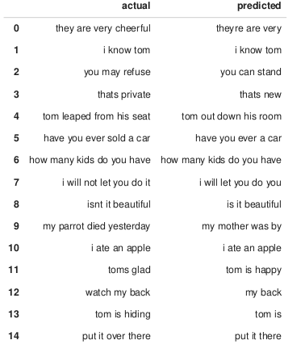
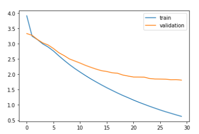

# Práctica TEXTO

Francisco Rodríguez Cuenca

## Introducción 

Para esta práctica he adaptado la práctica "Machine_Translation" para aceptar la traducción español-inglés.

Además, he comparado tres tipos de RNN distintas: Una RNN simple, un GRU y un LSTM, para ver cuál funcionaba mejor.

Para el modelo he utilizado el mismo esquema Seq2Seq del ejemplo, sustituyendo las dos redes LSTM por GRU o SimpleRNN en el codificador y decodificador.

## Comparación

En cuanto a complejidad, LSTM es el algoritmo más costoso, seguido por GRU y finalmente SimpleRNN.

Los resultados también siguen la misma jerarquía, con LSTM ofreciendo la mejor calidad de traducción, seguida por GRU y finalmente SimpleRNN.

Es difícil de interpretar cuál tiene una mejor traducción, pero se puede ver que LSTM traduce mejor las frases largas, y que GRu las traduce un poco peor, y finalmente SimpleRNN, con apenas memoria, le cuesta más:

   
   
frases LSTM

   
   
frases GRU

   
   
frases SimpleRNN

La función de pérdida sin embargo, progresa de manera muy similar en el tiempo:

   
   
Loss LSTM

   
   
Loss GRU

   
   
Loss SimpleRNN

 
## Código